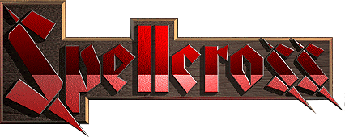

  

# Spellcross Reloaded

**Version 0.8.0** — a fan-made restoration, modernization and reverse-engineering project for **Spellcross (1997)**.

Spellcross Reloaded started years ago as a collection of tools for decoding and editing the original game data. It has since grown into a playable restoration of the game itself while keeping the map/resource editing and reverse-engineering tools that made the project possible.

The goal is deliberately conservative: **use the original Spellcross data, graphics, rules and UI wherever possible**, restore missing behaviour from the DOS executable and manuals, and make the game comfortable to run on modern Windows without turning it into a different game.

> **Status:** playable restoration in active development. The game is already usable end-to-end, but some edge cases and editor tools are still being refined.

---

## What works in 0.8.0

### Playable campaign and strategic layer

- Original-style main menu and game flow.
- Strategic campaign map with territory ownership, mission selection and turn progression.
- Mission briefings and debriefings.
- Alliance attacks and Other Side counterattacks.
- Mission objectives, success/failure handling and final-mission flow.
- Money, research points and strategic turn handling.
- Unit recruitment, replacement, rearming and upgrades.
- Research screen and technology progression.
- Army hierarchy/formations with commanders, battalions, regiments and brigades.
- Unit information, statistics, resources/territory management and strategic options.
- Restored strategic UI built largely from the original Spellcross resources instead of newly drawn replacements.

### Tactical battles

- Original terrain, objects, unit sprites, animations and palette data.
- Fog of war, visibility and line-of-sight handling.
- Terrain-aware movement and A* pathfinding.
- Direct and indirect fire, minimum/maximum ranges and air/ground targeting.
- Defensive/reaction fire.
- Unit experience and combat modifiers.
- Restored morale system: combat morale changes, recovery, long-term inactivity penalties, panic/flee behaviour, commander-loss shock and morale-related special attacks.
- Restored entrenchment rules using the original per-unit data and round timing.
- Special unit actions including radar states, transformations, aircraft take-off/landing and original Other Side abilities.
- Reworked enemy AI with contact behaviour, melee closing, mobile/static defence handling and difficulty modes.
- Original enemy-turn HUD overlay.
- Original movement/attack range modes and hotkeys.
- Save/load support for tactical game state.

### English-version group movement

Version 0.8.0 restores the multi-unit movement feature that existed in the **original English release** but was not exposed by the Czech release.

- Eight unit groups (`1`–`8`).
- Add/remove ground and air units from a group.
- Move a whole group toward a remote destination.
- Optional movement that keeps enough AP for one shot.
- Sequential group movement with replanning between units, matching the behaviour recovered from the English executable rather than moving every unit in parallel.
- Group membership is preserved in Spellcross Reloaded save states.

### Compatibility and original data

- Reads the original Spellcross archive/resource formats directly.
- Supports both Czech and English retail data where the underlying content differs.
- Can import required game data directly from an original Spellcross CD or mounted ISO (`DATA\INSTALL.DTA`).
- Can also use an existing installed/copied Spellcross `DATA` directory.
- Support for loading original Czech/English strategic save data, with compatibility checks for mission sets.
- Original sound effects and MIDI music playback.
- Original DPK/DP2 video playback; the proprietary CAN video codec is not fully decoded (audio is supported).

### Editor and reverse-engineering tools

The original map-editor/tooling side of the project is still present:

- Load and save tactical map `DTA`/`DEF` files.
- Render all map layers at runtime.
- Inspect and edit units.
- Basic terrain editing/copy-paste tools.
- Mission event/objective editing tools.
- Resource, sprite, palette, sound, MIDI and video loaders/viewers used during restoration work.

Some editor functionality is still experimental and less polished than the playable game mode.

---

## System requirements

The current release is intended for **64-bit Windows**.

**Tested on:**

- Windows 10 x64
- Windows 11 x64

You also need the current **Microsoft Visual C++ Redistributable (x64)**:

- Direct Microsoft download: https://aka.ms/vc14/vc_redist.x64.exe
- Microsoft documentation: https://learn.microsoft.com/en-us/cpp/windows/latest-supported-vc-redist

And, importantly, you need data from an **original copy of Spellcross**. Copyrighted retail game archives are not distributed with this project.

---

## Installation

1. Download the latest Windows x64 release from the GitHub **Releases** page.
2. Extract the archive to a normal writable directory. Do **not** run the game directly from inside the ZIP file.
3. Install the Microsoft Visual C++ Redistributable x64 linked above if it is not already installed.
4. Run `Spellcross.exe`.
5. On first launch, configure the original Spellcross game data when prompted.

There is no installer and no registry setup is required for the game itself. The release is intended to be portable.

### First launch: importing original game data

If required Spellcross resources are not configured, the game offers two paths:

**Original CD / mounted ISO — recommended**

1. Choose the option to import from the original Spellcross CD or mounted ISO.
2. Select either the CD root or its `DATA` directory.
3. Spellcross Reloaded locates `DATA\INSTALL.DTA`, extracts the installed archives and stores them locally under its `game_data` directory.
4. If the particular CD edition keeps additional archives outside `INSTALL.DTA`, the game also attempts to copy those automatically.

**Existing installation / manually copied data**

You can instead point the game to the required original archive files. Once one file is selected, the loader automatically searches the same directory for the others.

Core files include `COMMON.FS`, `T11.FS`, `PUST.FS`, `DEVAST.FS`, `UNITS.FSU`, `TEXTS.FS` and `INFO.FS`. `SAMPLES.FS` and `MUSIC.FS` are optional if you want to run without sound effects or music.

---

## Useful tactical controls

The UI is intentionally close to the original game, including its keyboard shortcuts.

| Control | Action |
| --- | --- |
| `Space` | Cycle Normal / Movement / Attack range mode |
| Hold `M` | Temporarily show movement range |
| Hold `A` | Temporarily show attack range |
| `Tab` | Tactical map |
| `I` | Toggle unit info bars |
| `O` | Tactical options |
| `Esc` | Cancel current action / leave current mode |

### Group movement controls (English original feature)

| Control | Action |
| --- | --- |
| `1`–`8` | Select/unselect one of eight groups |
| LMB on own ground unit | Add/remove it from the active group |
| `Shift` + LMB on own unit | Add/remove an air unit |
| `Alt` + `A` | Add all Alliance units to the active group |
| LMB on map | Move the active group toward that point |
| `Alt` + LMB on map | Move while reserving enough AP for one shot |
| RMB or `Esc` | Cancel group movement and leave group mode |

A unit can belong to only one group. Firing is disabled while group mode is active, as in the English original.

---

## Save-game notes

Spellcross Reloaded uses its own restoration save-state format for data that the original files cannot represent safely. The loader remains backward-compatible with older restoration saves where possible.

The project also contains compatibility code for original retail strategic saves. Czech and English editions do not contain exactly the same mission set, so incompatible retail saves are rejected instead of silently loading the wrong missions.

---

## Project philosophy

This is not intended to be a visual remake with replacement art or redesigned rules. When the original game already contains an asset, table, animation, sound, UI element or gameplay rule, the preferred solution is to **decode and use the original**.

Behaviour that was missing from the early editor code is reconstructed from several sources:

- the original Czech and English game data,
- the original manuals,
- comparison captures from the DOS game,
- and reverse engineering of `SPELCROS.EXE` where exact behaviour matters.

That approach is why some seemingly small details — enemy-turn HUDs, entrenchment timing, morale thresholds, special attacks, group movement order or formation behaviour — are treated as restoration work rather than redesigned from scratch.

---

## Known limitations

- The project is still under active development; unusual mission scripts and AI edge cases may still expose bugs.
- Some map-editor functions remain crude or incomplete compared with the playable restoration.
- Mission-event/objective editing is not yet a polished general-purpose editor workflow.
- The original proprietary CAN video codec is not fully implemented; CAN audio can be handled, while DPK/DP2 playback is implemented.
- Behaviour recovered from reverse engineering is continuously being checked against the original game, so small corrections are still expected.
- Only the Windows x64 builds listed above are currently tested for release use.

If you find a reproducible problem, a save made immediately before/after the failure is extremely useful for debugging tactical state-machine and AI issues.

---

## Building from source

The source tree contains the Visual Studio solution in `source/spellcross_map_editor.sln` and uses C++17 together with wxWidgets. The current project files target the MSVC toolchain and provide Win32/x64 configurations; release testing is currently focused on x64.

The project grew from older experimental reverse-engineering utilities originally written around 2007–2013. The current codebase progressively replaces those old mixed ANSI C/C++ and VCL-era experiments with reusable C++ loaders, decoders, renderers and gameplay systems.

---

## Legal / original game data

Spellcross Reloaded is an independent fan project and is not an official release by the original developer or publisher.

This repository does **not** grant rights to redistribute the original Spellcross retail data. You are expected to provide the required game files from your own copy of Spellcross.

The restoration/source code in this repository is distributed under the [MIT License](./LICENSE).

---

## Repository

Project home: https://github.com/luboshorak/spellcross_restoration_tools

Releases: https://github.com/luboshorak/spellcross_restoration_tools/releases
